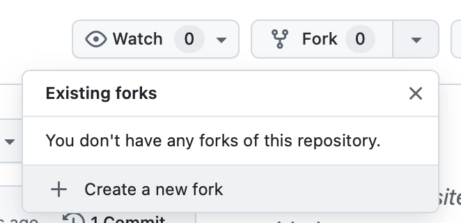
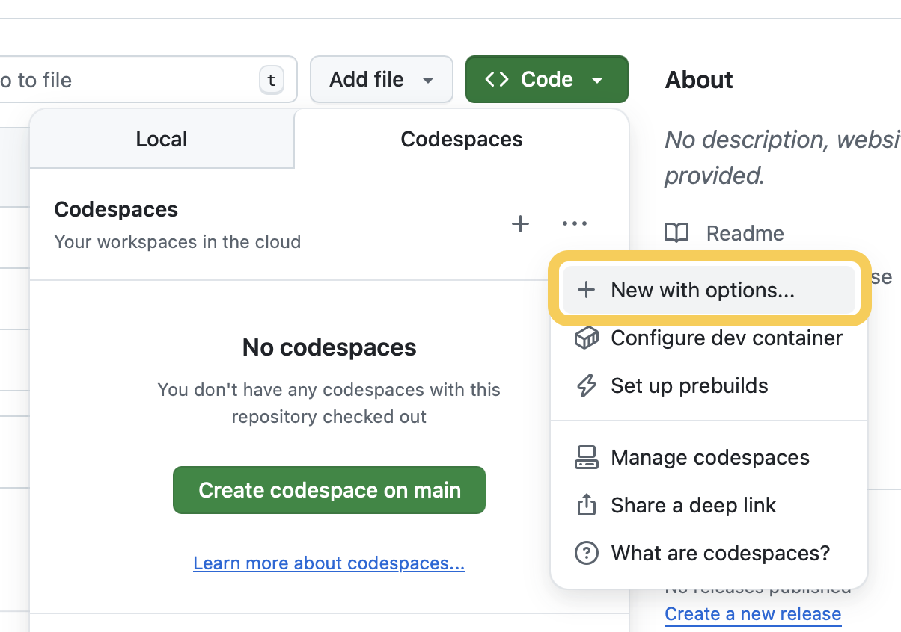
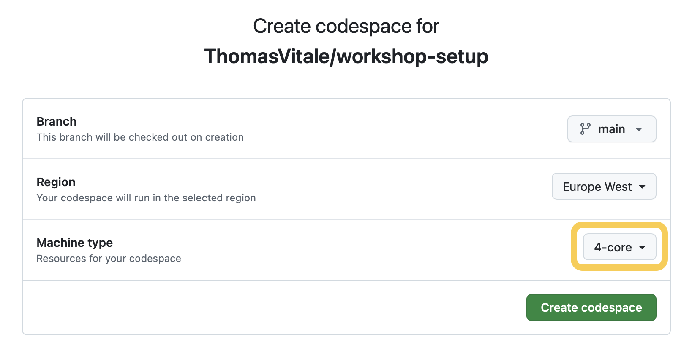
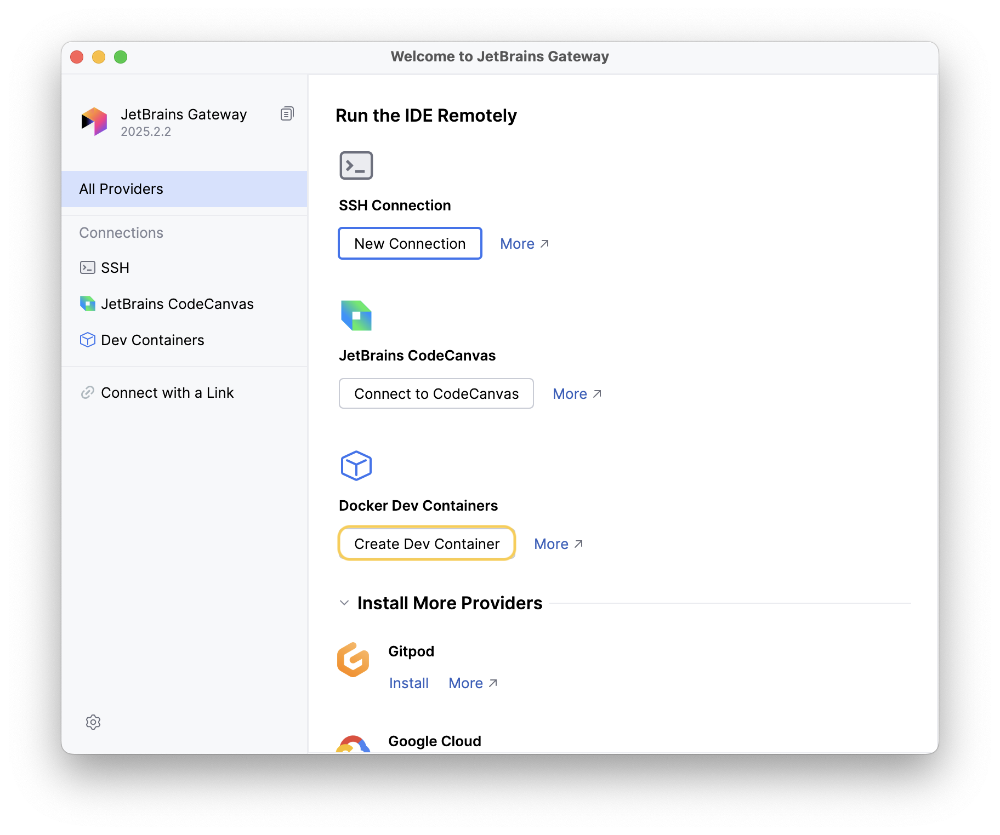
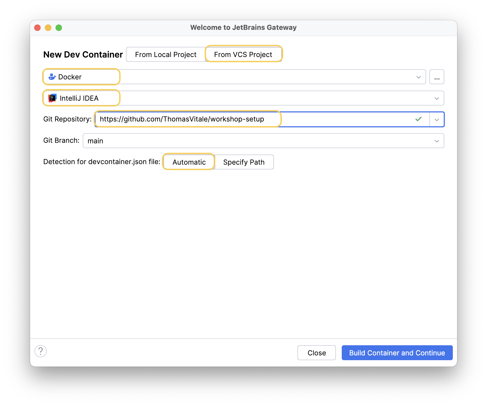
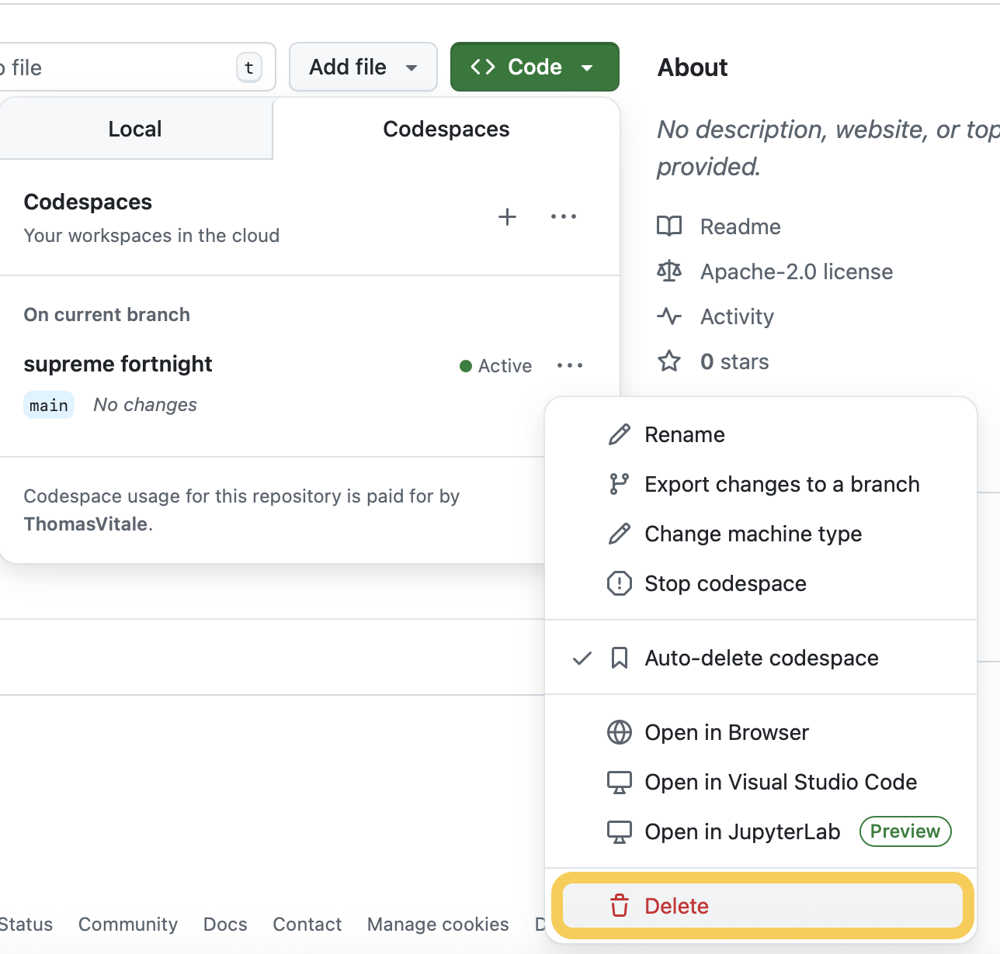

# Workshop Setup

This repository is intended to test out the setup for workshops. Ensure you have a personal [https://github.com](GitHub) account (free account is enough) before proceeding.

## 1. Starting the environment

The environment is based on Devcontainers and is supported across these platforms:

* GitHub Codespaces
* Visual Studio Code
* Intellij IDEA (experimental).

Choose your platform and follow the instructions in the related section.

### GitHub Codespaces

1. From a web browser, visit [https://github.com](github.com) and log in with your personal account.
2. Go to the main page of this repository at [github.com/ThomasVitale/workshop-setup](https://github.com/ThomasVitale/workshop-setup).
3. Create a new fork.

4. Choose _Code > Codespaces > New with options..._

5. Choose "4-core" as the machine type.

5. Click _Create codespace_.

The environment will open in an online version of Visual Studio Code. The first time it will take a couple of minutes to initialize the environment. Subsequent access will be faster.

### Visual Studio Code

Pre-requisites:
* [Visual Studio Code](https://code.visualstudio.com) installed on your laptop.
* Container runtime like [Podman Desktop](https://podman-desktop.io) or [Docker Desktop](https://docker.com) installed on your laptop.

1. Open Visual Studio Code on your laptop.
2. From the "Extensions" page, ensure the "Dev Containers" extension is installed. If not, you can install it by running this command from a Terminal window:

```shell
code --install-extension ms-vscode-remote.remote-containers
```

3. From a web browser, visit [https://github.com](github.com) and log in with your personal account.
4. Go to the main page of this repository at [github.com/ThomasVitale/workshop-setup](https://github.com/ThomasVitale/workshop-setup).
5. Create a new fork.
6. Open a Terminal window and run these commands to check out the fork on your own laptop (ensure you add your GitHub username in the URL) and open it in Visual Studio Code:

```shell
git clone https://github.com/<your-username>/workshop-setup.git
code workshop-setup.git
```

7. Visual Studio Code will show you a pop-up window asking you to "Reopen in Container" the project as a Devcontainers project. Accept the action. Alternatively, you can choose the "Reopen in Container" option after typing `Ctrl+Shift+P` (Windows/Linux) or `Cmd+Shift+P` (macOS).

The environment will run in a container on your local machine and you can work on it from your local Visual Studio Code. The first time it will take a couple of minutes to initialize the environment. Subsequent access will be faster.

### IntelliJ IDEA Ultimate

Pre-requisites:
* [IntelliJ IDEA Ultimate](https://www.jetbrains.com/idea/) installed on your laptop.
* [JetBrains Gateway](https://www.jetbrains.com/remote-development/gateway/) installed on your laptop.
* Container runtime like [Podman Desktop](https://podman-desktop.io) or [Docker Desktop](https://docker.com) installed on your laptop.

1. Go to the main page of this repository at [github.com/ThomasVitale/workshop-setup](https://github.com/ThomasVitale/workshop-setup).
2. Create a new fork.
3. Open JetBrains Gateway on your laptop.
4. Choose "Create Dev Container".

5. Add the information as shown in the picture. Ensure you replace the URL with the URL of your own fork.

6. Choose "Build Container and Continue".

The environment will run in a container on your local machine and you can work on it from your local IntelliJ IDEA Ultimate. The first time it will take a couple of minutes to initialize the environment. Subsequent access will be faster.

## 2. Testing the environment

1. Open a Terminal window from the IDE you're using to access the environment.
2. Run this command to validate the Spring Boot applications is compiled correctly and the tests run successfully.

```shell
cd demo
./gradlew build
```

You should expect to see a "BUILD SUCCESSFUL" message from Gradle.

Once it's done, go back to the parent folder.

```shell
cd ..
```

3. Run this command to test the usage of a Kubernetes cluster.

```shell
./test-cluster.sh
```

You should expect to see a "Testing completed successfully" message from the script execution.

## 3. Deleting the environment

### GitHub Codespaces

1. Go to the main page of your fork on [https://github.com](github.com).
2. Choose _Code > Codespaces > [Codespace Name] > Delete_


### Visual Studio Code

The environment runs locally as a container. You can therefore remove the environment by deleting the related container that you can find with `podman ps` or `docker ps`.

### IntelliJ IDEA Ultimate

The environment runs locally as a container. You can therefore remove the environment by deleting the related container that you can find with `podman ps` or `docker ps`.

Alternatively, you can remove it from JetBrains Gateway.
